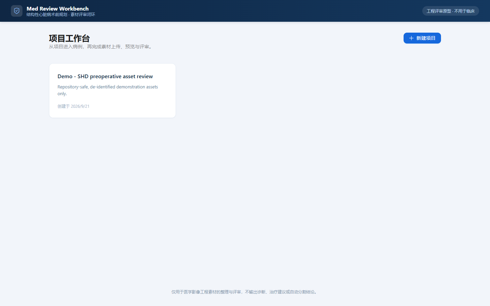
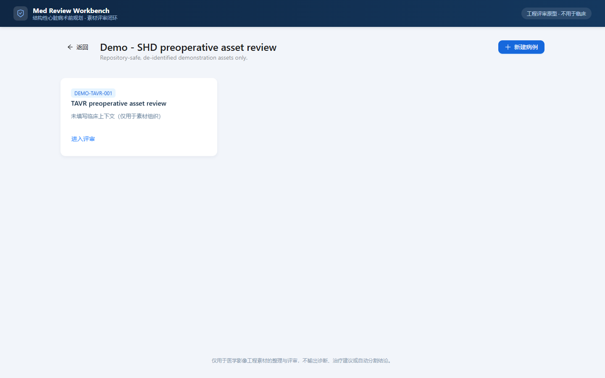
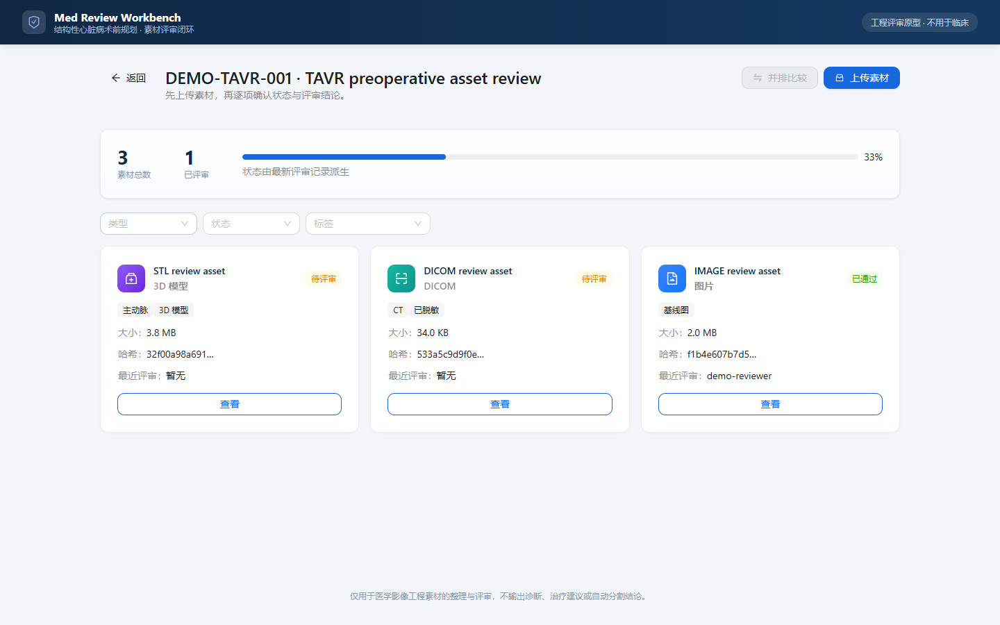
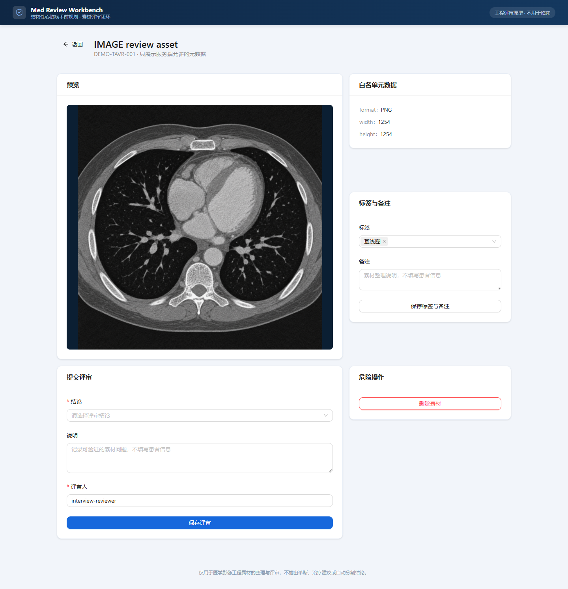
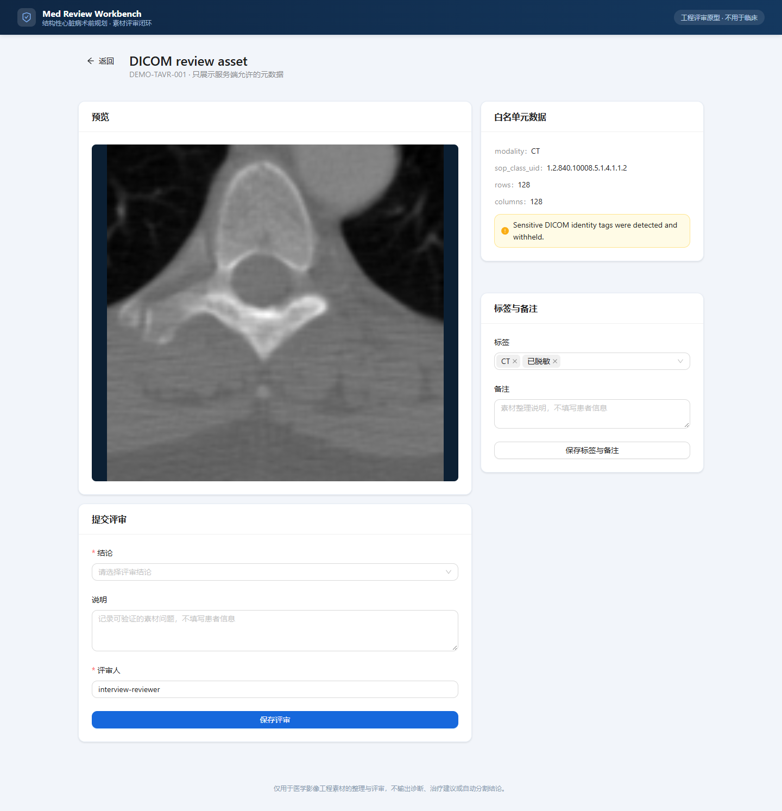
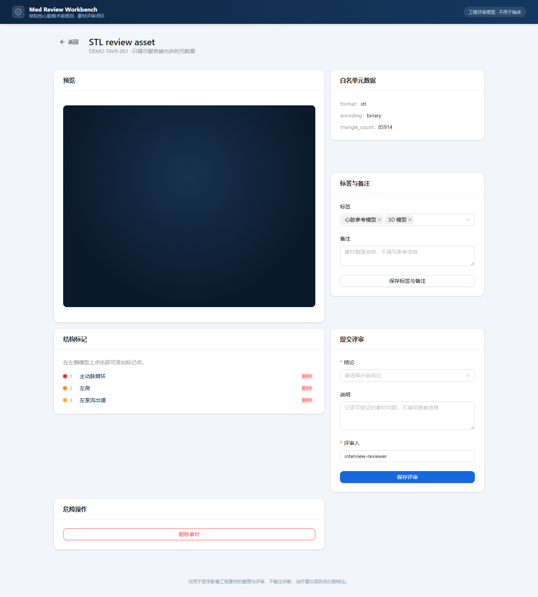

# Med Review Workbench

结构性心脏病术前规划素材评审工作台。

## 面试官快速启动

前置条件：安装并启动 Docker Desktop（或支持 Compose 的 Docker），确保 `docker compose version` 可执行：

```sh
git clone https://github.com/truyol/med-review-workbench.git
cd med-review-workbench
docker compose -f deploy/docker-compose.yml up -d --build --wait
docker compose -f deploy/docker-compose.yml exec -T api python -m app.ops.seed_demo --sample-root /sample-data
```

打开 `http://localhost:8080`，进入 `Demo - SHD preoperative asset review` → `DEMO-TAVR-001`。首次拉取基础镜像需要网络；已安装的 Docker 镜像可被复用。停止服务用 `docker compose -f deploy/docker-compose.yml down`，不要加 `-v`，否则会删除演示数据库和上传素材。

公开仓库包含两张非临床合成 PNG 和一份 [CC BY 4.0 心脏参考 STL](sample-data/stl/ATTRIBUTION.md)。seed 默认读取这份 STL；缺少本地清理 DICOM 时，会自动生成无患者来源的 64×64 DICOM phantom。因此全新克隆无需额外下载，就能演示图片、DICOM 和 3D。心脏 STL 不是这个 DICOM 的患者重建；题目附带的 STL 仍需另行取得、手动上传，且不进入 Git。所有演示素材都不用于医疗判断。

## 当前状态

P8 测试与证据已通过，P9 文档一致性已收口，当前进行 P10 交付验收；人工五分钟演示尚待确认。测试报告见 [P8 证据](docs/product/12-p8-test-report.md)，交付状态见 [交付清单](DELIVERY_CHECKLIST.md)。

- 项目根目录：克隆后的仓库根目录
- 当前阶段：P10 交付验收中
- 产品定位：结构性心脏病术前规划素材评审工作台
- 业务代码：P4 后端闭环与 P5 前端主流程已完成
- 原则：先从用户问题定义范围，再做技术设计和实现

## 项目阶段

`P0 环境准备 → P1 产品设计 → P2 技术设计 → P3 脚手架 → P4 后端 → P5 前端 → P6 异常/边界 → P7 运维化 → P8 测试 → P9 文档 → P10 交付验收`

阶段定义和退出门禁见 [项目生命周期](docs/PROJECT_LIFECYCLE.md)。阶段按顺序推进；允许提前记录后续设计想法，但不得把后续阶段标记为已完成。

## 产品定位

面向术前规划工程师和影像技术评审员，在结构性心脏病术前讨论前，把同一病例的 CT/DICOM、图片和 3D 解剖模型汇总、验证并留下可追溯评审结论。

本产品不做临床诊断，不替代 PACS，不提供自动分割、治疗建议或真实患者系统接入。

## 界面预览

| 项目工作台 | 病例列表 |
|---|---|
|  |  |

| 病例评审看板 | 图片预览 | DICOM 白名单预览 | 3D 模型与结构标记 |
|---|---|---|---|
|  |  |  |  |

截图由 `apps/web/scripts/capture-screenshots.mjs` 从运行中的演示栈自动生成：

```powershell
cd apps\web
node scripts\capture-screenshots.mjs
```

## 已实现功能

- 项目 → 病例 → 素材三级结构；素材在病例上下文中可追溯。
- 素材上传与**服务端判型**（DICOM / STL / PNG / JPEG），记录 UUID、大小、SHA256 与通用来源类别；逐素材来源/许可/脱敏状态字段尚未实现。
- **图片**：缩略图浏览、类型/状态/标签筛选、标签与备注整理。
- **图片并排比较**：选择两张图片并排对照，辅助标注图与基线图的比对。
- **DICOM**：白名单元数据、缩略图、多帧识别、无像素/解码失败降级。
- **3D（STL）**：旋转、缩放、平移、视角复位，以及点击模型放置**结构标记**；支持**线框**与**半透明**模式以查看内部网格结构。
- **评审**：结论（通过/需补充/拒绝）+ 说明 + 评审人，素材状态由最新评审派生。
- **删除素材**：未评审素材可删除；已评审素材后端拒绝删除（`DELETE_RESTRICTED`），保护评审历史。
- 统一错误信封（稳定错误码 + `next_action` + `request_id`）与结构化 JSON 日志。

## 产品思维门禁

每个功能进入 MVP 前必须回答：

1. 解决谁的什么痛点。
2. 做什么，不做什么。
3. 是否属于主流程闭环。
4. 如何通过一个用户流程验证。

## 文档入口

- [产品简介](docs/product/00-product-brief.md)
- [定位决策](docs/product/01-positioning-options.md)
- [用户流程与范围](docs/product/02-user-flow-and-scope.md)
- [PRD](docs/PRD.md)
- [PRD 详细版](docs/product/03-prd.md)
- [验收矩阵](docs/product/04-acceptance-matrix.md)
- [问题收口](docs/product/05-open-questions.md)
- [五分钟演示脚本](docs/product/06-demo-script.md)
- [AI 使用与医疗决策边界](docs/product/07-ai-product-boundary.md)
- [技术设计（P2 权威）](TECH_DESIGN.md)
- [技术架构（P2 输入草案）](docs/design/architecture.md)
- [DICOM 元数据白名单](docs/design/dicom-metadata-whitelist.md)
- [开发规范](docs/engineering/development.md)
- [隐私与安全](docs/engineering/privacy-and-security.md)
- [真实医疗软件场景能力差距](docs/engineering/real-world-readiness.md)
- [AI 使用记录](docs/engineering/ai-usage.md)
- [环境准备记录](docs/engineering/environment.md)
- [演示与测试数据规范](docs/engineering/demo-and-test-data.md)
- [项目进度](PROGRESS.md)
- [P4 后端收口验收清单](docs/product/08-p4-backend-acceptance.md)
- [P5 前端验收清单](docs/product/09-p5-frontend-acceptance.md)
- [P6 异常与边界验收](docs/product/10-p6-boundary-acceptance.md)
- [P7 运维手册](docs/engineering/ops.md)
- [P7 运维化验收清单](docs/product/11-p7-operations-acceptance.md)
- [P8 测试与证据报告](docs/product/12-p8-test-report.md)
- [GitHub 面试交付复核](docs/product/13-delivery-readiness.md)
- [P9 文档一致性验收](docs/product/14-p9-documentation-acceptance.md)
- [P10 交付清单](DELIVERY_CHECKLIST.md)
- [项目生命周期](docs/PROJECT_LIFECYCLE.md)

## 计划技术栈

- Web：React、TypeScript、Vite、Ant Design
- 3D：Three.js、React Three Fiber、STLLoader
- API：FastAPI、Pydantic、SQLAlchemy、Alembic
- DICOM：pydicom、NumPy、Pillow
- 数据：SQLite；生产演进目标为 PostgreSQL
- 测试：pytest、Vitest、Playwright
- 部署：Docker Compose、Nginx（部署阶段引入）

## 本地环境

```powershell
powershell -ExecutionPolicy Bypass -File .\scripts\verify-env.ps1
powershell -ExecutionPolicy Bypass -File .\scripts\bootstrap.ps1
powershell -ExecutionPolicy Bypass -File .\scripts\check.ps1
```

提交/交付前的 P8 完整门禁会启动 Docker 环境，并执行覆盖率、真实后端 E2E、隐私日志扫描和依赖审计：

```powershell
powershell -ExecutionPolicy Bypass -File .\scripts\check-full.ps1
```

准备本地演示数据（仓库内合成 PNG、心脏参考 STL；DICOM 使用本地清理副本或合成 phantom）：

```powershell
cd apps/api
.\.venv\Scripts\python.exe ..\..\scripts\seed-demo.py
```

容器部署使用独立的 `/data/medreview.db`。Compose 启动后需要演示数据时执行：

```powershell
docker compose -f .\deploy\docker-compose.yml exec -T api `
  python -m app.ops.seed_demo --sample-root /sample-data
```

前端主流程 E2E：

```powershell
cd apps/web
npm.cmd run e2e
```

首次运行需要本机安装 Playwright Chromium：`npx playwright install chromium`。

如需重新生成本地 DICOM 清理副本：

```powershell
.\apps\api\.venv\Scripts\python.exe .\scripts\prepare-dicom-samples.py
```

`.env.example` 中的 `APP_ALLOWED_ORIGINS` 是 JSON 数组；复制为 `.env` 后可直接被 `pydantic-settings` 解析。

## 样例数据获取与准备

仓库提交两张明确为非临床的合成 PNG 和一份有 [来源与 CC BY 4.0 署名](sample-data/stl/ATTRIBUTION.md)的心脏参考 STL。全新克隆的 seed 会在运行时生成小型 DICOM phantom，**不要求面试官额外下载素材**。以下步骤仅用于验证特定公开 DICOM 或题目提供的可选 STL；这些外部原始文件因隐私、许可或体积原因不进入 Git。来源、哈希、使用条件和清理状态见 [样例数据登记](sample-data/README.md)。

1. 先完成依赖安装：

   ```powershell
   powershell -ExecutionPolicy Bypass -File .\scripts\bootstrap.ps1
   ```

2. 从已安装的 pydicom 测试数据复制 `CT_small.dcm`：

   ```powershell
   New-Item -ItemType Directory -Path .\sample-data\dicom -Force
   $ctSource = & .\apps\api\.venv\Scripts\python.exe -c "from pydicom.data import get_testdata_file; print(get_testdata_file('CT_small.dcm'))"
   Copy-Item -LiteralPath $ctSource -Destination .\sample-data\dicom\CT_small.dcm
   ```

3. 如需验证 96 帧压缩 XA 边界，从 [Rubo Sample DICOM files](https://www.rubomedical.com/dicom_files/) 手工下载 `DEMO 0002`，按其使用条件解压为：

   ```text
   sample-data/dicom/rubo_angiogram_0002/0002.DCM
   ```

   Rubo 样例只用于本地评价，不得随本仓库再分发。未准备该可选样例时，基础 DICOM 路径仍可使用 `CT_small.dcm` 验证。

4. 如需另行展示面试题 `DEMO SET/stl/` 下的 STL，可将其复制到：

   ```text
   sample-data/stl/
   ```

   这些可选模型不会替换默认 seed 的心脏模型；请在页面中手动上传。录屏优先选用仓库内的心脏参考模型，并在讲解中说明它与 DICOM 并非同一病例。

5. 原始 DICOM 含已填充的演示身份标签，不能直接用于应用或演示。准备完成后生成本地清理副本：

   ```powershell
   .\apps\api\.venv\Scripts\python.exe .\scripts\prepare-dicom-samples.py
   ```

   脚本会处理所有已存在的样例并跳过缺失的可选样例；如果一个原始 DICOM 都没有，则明确失败并提示先按本节准备数据。

安装完成后，VS Code 应选择解释器：

```text
apps/api/.venv/Scripts/python.exe
```

## 本地启动

后端：

```powershell
cd apps/api
.\.venv\Scripts\python.exe -m uvicorn app.main:app --reload --port 8000
```

前端：

```powershell
cd apps/web
npm.cmd run dev
```

访问：

- API 文档：`http://127.0.0.1:8000/api/docs`
- 后端健康检查：`http://127.0.0.1:8000/api/v1/health`
- 前端开发页：`http://127.0.0.1:5173`

## Docker 演示环境

推荐用 Docker 一键演示（Nginx + API + 持久卷）：

```powershell
docker compose -f .\deploy\docker-compose.yml up -d --build --wait
docker compose -f .\deploy\docker-compose.yml exec -T api python -m app.ops.seed_demo --sample-root /sample-data
```

访问 `http://localhost:8080`。

演示数据被污染或需要重来时：

```powershell
powershell -ExecutionPolicy Bypass -File .\scripts\reset-demo.ps1
```

> 注意：宿主机数据库（`apps/api/var/`）与容器卷（`/data`）**不可混用**，因为预览/模型记录的是创建时的绝对路径。二选一即可，详见 `docs/engineering/demo-and-test-data.md`。

## 测试门禁

```powershell
# 快速门禁：静态检查 + 单元/集成 + 前端构建
powershell -ExecutionPolicy Bypass -File .\scripts\check.ps1

# 完整门禁（P8）：隔离栈 + 覆盖率 + 真实 E2E + 隐私扫描 + 依赖审计
powershell -ExecutionPolicy Bypass -File .\scripts\check-full.ps1
```

完整门禁使用隔离的 Compose 项目与端口（`medreview-p8-gate` / `18080`），结束后连卷一起销毁，**不会污染演示数据**。

## 当前已知限制

- DICOM 清理脚本只处理 demo 的直接身份标签、私有标签和 UID，不等同于临床级去标识化，也不证明像素中没有烧录文字。
- Rubo DICOM 仅用于本地评价，不随仓库分发；全新克隆默认使用运行时生成的非临床 DICOM phantom 和仓库内有 CC BY 4.0 署名的心脏参考 STL。
- 测试存在来自 FastAPI/Starlette TestClient 依赖的弃用警告；不影响当前测试结果，待上游兼容版本稳定后升级。
- 前端已按 vendor 拆分：应用主包约 54KB，`antd` / `react` 独立成可缓存 vendor chunk，`three.js` 仅在进入 STL 详情时加载。
- 真实鉴权、持久化审计表、reprocess、标注批量编辑和 PostgreSQL 生产验证仍在延期范围，详见 `docs/product/12-p8-test-report.md` 与 `PROGRESS.md`。

## API 一览

核心接口（统一前缀 `/api/v1`）：

- 项目：`POST/GET /projects`
- 病例：`POST/GET /projects/{project_id}/cases`
- 素材：`POST/GET /cases/{case_id}/assets`、`PATCH/DELETE /assets/{asset_id}`
- 素材读取：`GET /assets/{asset_id}/preview`、`GET /assets/{asset_id}/model`
- 结构标记：`POST/GET /assets/{asset_id}/annotations`、`DELETE /annotations/{annotation_id}`
- 评审：`POST /assets/{asset_id}/reviews`、`GET /cases/{case_id}/review-board`
- 健康：`GET /health`、`GET /health/ready`

素材校验与隐私：

- DICOM 白名单元数据提取，身份字段抑制；
- 元数据可读但预览不可用时降级，不返回 500；
- STL 二进制/ASCII 校验并记录三角面数量；
- 素材列表支持 `kind` / `status` / `tag` 过滤；
- 上传响应与日志不包含原始文件名或 DICOM 身份值。

范围提示：`source_label` 目前仅是服务端生成的素材类别，不是逐素材来源登记；许可与清理状态只对仓库样例在 `sample-data/README.md` 留档。评审持久化的是决定、备注、评审人和时间，问题摘要/下一步尚无独立业务字段；项目/病例详情及更新接口、独立评审历史接口尚未实现。详见 [技术设计](TECH_DESIGN.md)。
